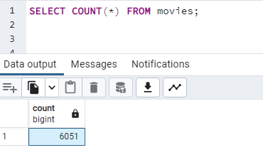

# Movies-ETL
Extract, Transform, Load.

## Purpose
1. Create automated pipeline of functions to extract data from different sources and load into python for data cleaning purposes
2. Use self-made functions in addition to regular expressions to filter, clean, sort, and load relevant data from into usable pandas dataframes
3. Use PostgreSQL python library to export data into SQL database
4. Verify data was correctly exported with PgAdmin

## Summary
* Shown below are the final queries and results after the data has finished going through the ETL pipeline created for this challenge. Both data tables in SQL show the expected number of rows in the respective tables in the database.

